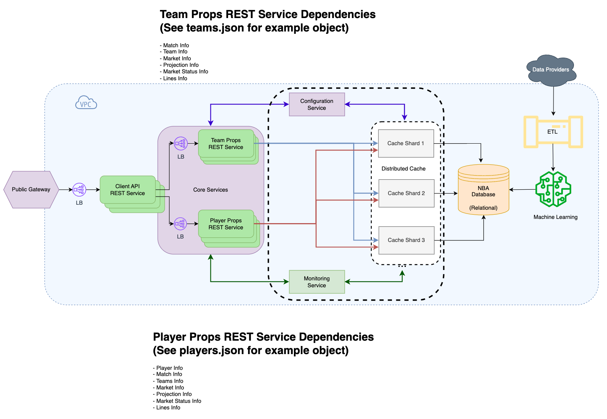
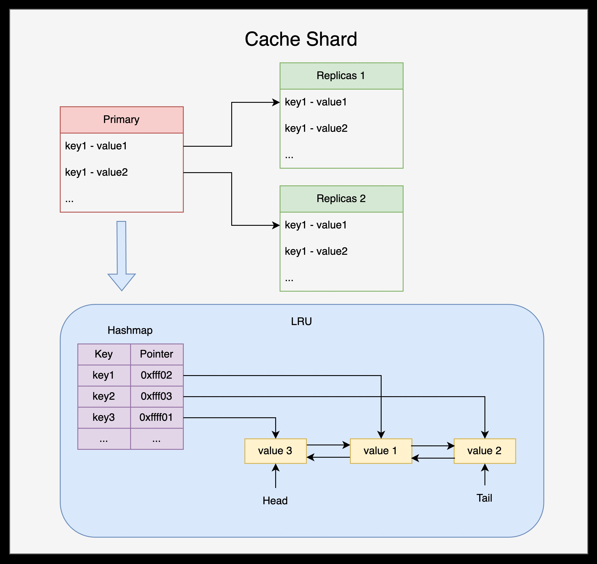

# Swish Analytics Engineering Project

## Part 1

In the first part, a search API is implemented to query information based on either `playerId` or `eventId`, with
results sorted in ascending or descending order.

There are two main functions that I needed to implement in this server-`search` and `sort`.

### Search

There are several ways to implement search functionality such as linear or binary search. If we are using in-memory
database, I believe the best way to implement searching capability is using hash table due to its quick search
performance.

A hash table is a data structure that stores key-value pairs, allowing for efficient data retrieval in constant time on
average. It uses a hash function to compute an index (or hash code) for each key, mapping it to a specific "bucket"
where the value is stored. If multiple keys hash to the same index, a collision resolution strategy (like chaining or
open addressing) is used to manage them. Hash tables are widely used in scenarios requiring fast lookups, such as
implementing dictionaries or caches.

The performance of a hash table depends on its operations and how well it handles collisions.

- Average-Case Performance

  - Insert: O(1) – Adding an item involves computing the hash and placing it in a bucket.
  - Search: O(1) – Retrieving an item by its key typically involves just one lookup.

- Worst-Case Performance:

  - Insert/Search/Delete: O(n) – In the worst case (e.g., if all elements hash to the same bucket), operations may
    require traversing all items in a bucket.

- Factors Affecting Performance:

  - Load Factor: The ratio of the number of elements to the number of buckets. A higher load factor increases collisions
    and slows down operations. Typically, hash tables are resized when the load factor exceeds a threshold (e.g., 0.75).

  - Hash Function Quality: A good hash function evenly distributes keys across buckets to minimize collisions. Overall,
    hash tables provide excellent performance for most practical scenarios but can degrade if poorly managed or if the
    hash function is inefficient.

Since the requirement in this part of the project is to implement this search function in raw, I implemented this hash
table without using JavaScript's `Map` object or JavaScript's `Object` data type. I put the initial bucket size as `10`
and put `0.75` as a load factor. If the element count increases, it will resize the buckets and rehash all the old
bucket items into the new bucket.

### Sort

There are several comparison-based sorting algorithms as you can see below:

- Bubble Sort: Compares adjacent elements and swaps them if out of order. Simple but inefficient (O(n<sup>2</sup>))

- Selection Sort: Repeatedly selects the smallest (or largest) element and places it in the correct position. Also
  (O(n<sup>2</sup>))

- Insertion Sort: Builds a sorted list one element at a time by inserting each element in its proper position. Best-case
  O(n) (nearly sorted lists); worst-case (O(n<sup>2</sup>)).

- Merge Sort: A divide-and-conquer algorithm that splits the array into halves, sorts them, and merges them. Always O (
  𝑛 log 𝑛 ).

- Quick Sort: Picks a pivot, partitions the array, and recursively sorts the partitions. Average-case O ( 𝑛 log 𝑛 ) but
  O(n<sup>2</sup>) in the worst case (unbalanced pivot selection).

Merge sort and quick sort have similar average performance and either would be an excellent choice for implementing
sorting capability.

Merge sort shows more stable performance and it guarantees O ( 𝑛 log 𝑛 ) performance even in the worst case. But it
requires O(n) extra memory to hold temporary arrays during the merge process, making it less efficient for systems with
limited memory.

Quick sort might show worst-case performance when the pivor is poorly chosen. However, this can be mitigated by using
randomized pivots. Quick sort is useful when memory is a concen or when average-case speed is crucial. And it's
generally good choice for sorting arrays.

In the project, I implemented the most popular sorting method, quick sort.

### Installation

```
cd part 1
part1> npm install
```

### Run the program

[develop]: You can update the code in real time and it will be reflected to the server.

```
part1> npm run dev
```

[production]

```
part1> npm run start
```

### Search Examples

1. Query player info

```
http://localhost:8080/api/search?playerId=338365
```

```
[
  {
    "id": 4336379,
    "season": 2017,
    "date": "2017-10-17",
    "event_id": 1947346,
    "team_id": 9,
    "team_abbr": "GS",
    "opp_id": 10,
    "opp_abbr": "Hou",
    "player_id": 338365,
    "name": "Stephen Curry",
    "primary_pos_abbr": "PG",
    "stat_type": "steals",
    "projection": 2.18,
    "line": 2
  }
]
```

2. Query Event

```
http://localhost:8080/api/search?eventId=1947132
```

```
[
  {
    "id": 7021129,
    "season": 2017,
    "date": "2017-10-18",
    "event_id": 1947132,
    "team_id": 15,
    "team_abbr": "Mil",
    "opp_id": 2,
    "opp_abbr": "Bos",
    "player_id": 467468,
    "name": "Greg Monroe",
    "primary_pos_abbr": "C",
    "stat_type": "assists",
    "projection": 2.16,
    "line": 2
  },
  {
    "id": 7022547,
    "season": 2017,
    "date": "2017-10-18",
    "event_id": 1947132,
    "team_id": 15,
    "team_abbr": "Mil",
    "opp_id": 2,
    "opp_abbr": "Bos",
    "player_id": 512053,
    "name": "Khris Middleton",
    "primary_pos_abbr": "SG",
    "stat_type": "three made",
    "projection": 1.66,
    "line": 1.5
  },
  {
    "id": 7021138,
    "season": 2017,
    "date": "2017-10-18",
    "event_id": 1947132,
    "team_id": 15,
    "team_abbr": "Mil",
    "opp_id": 2,
    "opp_abbr": "Bos",
    "player_id": 531447,
    "name": "Matthew Dellavedova",
    "primary_pos_abbr": "PG",
    "stat_type": "assists",
    "projection": 2.94,
    "line": 3
  },
  {
    "id": 7022561,
    "season": 2017,
    "date": "2017-10-18",
    "event_id": 1947132,
    "team_id": 15,
    "team_abbr": "Mil",
    "opp_id": 2,
    "opp_abbr": "Bos",
    "player_id": 550991,
    "name": "Tony Snell",
    "primary_pos_abbr": "SG",
    "stat_type": "three made",
    "projection": 1.92,
    "line": 1.5
  },
  {
    "id": 7021338,
    "season": 2017,
    "date": "2017-10-18",
    "event_id": 1947132,
    "team_id": 15,
    "team_abbr": "Mil",
    "opp_id": 2,
    "opp_abbr": "Bos",
    "player_id": 601146,
    "name": "Malcolm Brogdon",
    "primary_pos_abbr": "PG",
    "stat_type": "three made",
    "projection": 1.29,
    "line": 1
  },
  {
    "id": 7021698,
    "season": 2017,
    "date": "2017-10-18",
    "event_id": 1947132,
    "team_id": 15,
    "team_abbr": "Mil",
    "opp_id": 2,
    "opp_abbr": "Bos",
    "player_id": 739957,
    "name": "Giannis Antetokounmpo",
    "primary_pos_abbr": "PF",
    "stat_type": "blocks",
    "projection": 1.8,
    "line": 1.5
  },
  {
    "id": 7022940,
    "season": 2017,
    "date": "2017-10-18",
    "event_id": 1947132,
    "team_id": 15,
    "team_abbr": "Mil",
    "opp_id": 2,
    "opp_abbr": "Bos",
    "player_id": 920067,
    "name": "Thon Maker",
    "primary_pos_abbr": "C",
    "stat_type": "assists",
    "projection": 1.25,
    "line": 1
  }
]
```

3. Query the intersection of a specific player and an event

```
http://localhost:8080/api/search?playerId=338365&eventId=1947132
```

```
[]
```

4. Query the intersection of a specific player and an event

```
http://localhost:8080/api/search?playerId=338365&eventId=1947346
```

```
[
  {
    "id": 4336379,
    "season": 2017,
    "date": "2017-10-17",
    "event_id": 1947346,
    "team_id": 9,
    "team_abbr": "GS",
    "opp_id": 10,
    "opp_abbr": "Hou",
    "player_id": 338365,
    "name": "Stephen Curry",
    "primary_pos_abbr": "PG",
    "stat_type": "steals",
    "projection": 2.18,
    "line": 2
  }
]
```

5. Query data with specific event ID, with results sorted in descending order

```
http://localhost:8080/api/search?eventId=1947132&sortBy=desc
```

```
[
  {
    "id": 7022940,
    "season": 2017,
    "date": "2017-10-18",
    "event_id": 1947132,
    "team_id": 15,
    "team_abbr": "Mil",
    "opp_id": 2,
    "opp_abbr": "Bos",
    "player_id": 920067,
    "name": "Thon Maker",
    "primary_pos_abbr": "C",
    "stat_type": "assists",
    "projection": 1.25,
    "line": 1
  },
  {
    "id": 7021698,
    "season": 2017,
    "date": "2017-10-18",
    "event_id": 1947132,
    "team_id": 15,
    "team_abbr": "Mil",
    "opp_id": 2,
    "opp_abbr": "Bos",
    "player_id": 739957,
    "name": "Giannis Antetokounmpo",
    "primary_pos_abbr": "PF",
    "stat_type": "blocks",
    "projection": 1.8,
    "line": 1.5
  },
  {
    "id": 7021338,
    "season": 2017,
    "date": "2017-10-18",
    "event_id": 1947132,
    "team_id": 15,
    "team_abbr": "Mil",
    "opp_id": 2,
    "opp_abbr": "Bos",
    "player_id": 601146,
    "name": "Malcolm Brogdon",
    "primary_pos_abbr": "PG",
    "stat_type": "three made",
    "projection": 1.29,
    "line": 1
  },
  {
    "id": 7022561,
    "season": 2017,
    "date": "2017-10-18",
    "event_id": 1947132,
    "team_id": 15,
    "team_abbr": "Mil",
    "opp_id": 2,
    "opp_abbr": "Bos",
    "player_id": 550991,
    "name": "Tony Snell",
    "primary_pos_abbr": "SG",
    "stat_type": "three made",
    "projection": 1.92,
    "line": 1.5
  },
  {
    "id": 7021138,
    "season": 2017,
    "date": "2017-10-18",
    "event_id": 1947132,
    "team_id": 15,
    "team_abbr": "Mil",
    "opp_id": 2,
    "opp_abbr": "Bos",
    "player_id": 531447,
    "name": "Matthew Dellavedova",
    "primary_pos_abbr": "PG",
    "stat_type": "assists",
    "projection": 2.94,
    "line": 3
  },
  {
    "id": 7022547,
    "season": 2017,
    "date": "2017-10-18",
    "event_id": 1947132,
    "team_id": 15,
    "team_abbr": "Mil",
    "opp_id": 2,
    "opp_abbr": "Bos",
    "player_id": 512053,
    "name": "Khris Middleton",
    "primary_pos_abbr": "SG",
    "stat_type": "three made",
    "projection": 1.66,
    "line": 1.5
  },
  {
    "id": 7021129,
    "season": 2017,
    "date": "2017-10-18",
    "event_id": 1947132,
    "team_id": 15,
    "team_abbr": "Mil",
    "opp_id": 2,
    "opp_abbr": "Bos",
    "player_id": 467468,
    "name": "Greg Monroe",
    "primary_pos_abbr": "C",
    "stat_type": "assists",
    "projection": 2.16,
    "line": 2
  }
]
```

6. Query data with specific event ID, with results sorted in ascending order

```
http://localhost:8080/api/search?eventId=1947132&sortBy=asc
```

```
[
  {
    "id": 7021129,
    "season": 2017,
    "date": "2017-10-18",
    "event_id": 1947132,
    "team_id": 15,
    "team_abbr": "Mil",
    "opp_id": 2,
    "opp_abbr": "Bos",
    "player_id": 467468,
    "name": "Greg Monroe",
    "primary_pos_abbr": "C",
    "stat_type": "assists",
    "projection": 2.16,
    "line": 2
  },
  {
    "id": 7022547,
    "season": 2017,
    "date": "2017-10-18",
    "event_id": 1947132,
    "team_id": 15,
    "team_abbr": "Mil",
    "opp_id": 2,
    "opp_abbr": "Bos",
    "player_id": 512053,
    "name": "Khris Middleton",
    "primary_pos_abbr": "SG",
    "stat_type": "three made",
    "projection": 1.66,
    "line": 1.5
  },
  {
    "id": 7021138,
    "season": 2017,
    "date": "2017-10-18",
    "event_id": 1947132,
    "team_id": 15,
    "team_abbr": "Mil",
    "opp_id": 2,
    "opp_abbr": "Bos",
    "player_id": 531447,
    "name": "Matthew Dellavedova",
    "primary_pos_abbr": "PG",
    "stat_type": "assists",
    "projection": 2.94,
    "line": 3
  },
  {
    "id": 7022561,
    "season": 2017,
    "date": "2017-10-18",
    "event_id": 1947132,
    "team_id": 15,
    "team_abbr": "Mil",
    "opp_id": 2,
    "opp_abbr": "Bos",
    "player_id": 550991,
    "name": "Tony Snell",
    "primary_pos_abbr": "SG",
    "stat_type": "three made",
    "projection": 1.92,
    "line": 1.5
  },
  {
    "id": 7021338,
    "season": 2017,
    "date": "2017-10-18",
    "event_id": 1947132,
    "team_id": 15,
    "team_abbr": "Mil",
    "opp_id": 2,
    "opp_abbr": "Bos",
    "player_id": 601146,
    "name": "Malcolm Brogdon",
    "primary_pos_abbr": "PG",
    "stat_type": "three made",
    "projection": 1.29,
    "line": 1
  },
  {
    "id": 7021698,
    "season": 2017,
    "date": "2017-10-18",
    "event_id": 1947132,
    "team_id": 15,
    "team_abbr": "Mil",
    "opp_id": 2,
    "opp_abbr": "Bos",
    "player_id": 739957,
    "name": "Giannis Antetokounmpo",
    "primary_pos_abbr": "PF",
    "stat_type": "blocks",
    "projection": 1.8,
    "line": 1.5
  },
  {
    "id": 7022940,
    "season": 2017,
    "date": "2017-10-18",
    "event_id": 1947132,
    "team_id": 15,
    "team_abbr": "Mil",
    "opp_id": 2,
    "opp_abbr": "Bos",
    "player_id": 920067,
    "name": "Thon Maker",
    "primary_pos_abbr": "C",
    "stat_type": "assists",
    "projection": 1.25,
    "line": 1
  }
]
```

## Part 2

The second part focuses on the system architecture design to support and power two core services-`Team Props` and
`Player Props`.

### Overview

As an updated version of the system architecture, I suggest to add a distributed cache layer after microservices to
increase the system performance, and add load balancers before REST microservice layer to avoid single point of
failure(SPOF):



The details will be explained later.

### Microservice

#### Team Props Microservice

The `Team Props Microservice` manages and provides data related to team-specific betting propositions (props). This
includes team-level statistics, betting markers, probabilities, and outcomes for specific matches

**Request Parameters:**

- Team Info
  - `teamId`: The unique identifier for a team
    - Example: `teamId=6` (represents `Dallas Mavericks`)
- Match Info
  - `matchId`: The unique identifier for a match
    - Example: `matchId=2292111`
- Market Info
  - `marketType`: Specifies the type of betting market (e.g., `Moneyline`, `Spread`, `Total Points`)
- Projection Info
  - `projectionType`: Specifies the projection data type to retrieve (e.g., `mean`, `median`, `all`)
    - Example: `projectType=mean`
- Market Status Info
  - `marketStatus`: Filters results based on the current market status (e.g., `active`, `suspended`)
    - Example: `marketStatus=active`
- Lines Info
  - `lineRange`: Filters results for lines within a specific range
    - Example: `lineRange=0.5-1.5`

**API Endpoints:**

1. Get Team Props by Team ID

- Endpoint: GET /teams/{teamId}/props
- Purpose: Retrieve props for a specific team based on various parameters.
- Request Parameters:
  - teamId (mandatory: query parameter): The unique identifier for a team.
  - matchId (optional): The unique identifier for the match.
  - marketType (optional): Specifies the type of betting market (e.g., Moneyline).
  - projectionType (optional): Specifies the projection type to retrieve (e.g., mean).
  - marketStatus (optional): Filters by market status (e.g., active).
  - lineRange (optional): Filters by line range(e.g., 0.5-1.5).
- Example Request:

```

GET /teams/6/props?matchId=2292111&marketType=Moneyline&projectionType=mean&marketStatus=active&lineRange=0.5-1.5

```

- Example Response:

```
{
  "team": {
    "id": 6,
    "abbr": "Dal"
  },
  "matchId": 2292111,
  "marketType": "Moneyline",
  "marketStatus": "active",
  "projections": {
    "mean": 0.6336,
    "median": 0.6336
  },
  "lines": [
    {
      "line": 0.5,
      "probs": {
        "over": 0.6332,
        "under": 0.3668
      },
      "status": "Market Not Suspended"
    }
  ]
}
```

1. Get Team Props for a Match

- Endpoint: GET /matches/{matchId}/teams
- Purpose: Retrieve props for both home and away teams in a specific match.
- Request Parameters:
  - matchId (mandatory: query parameter): The unique identifier for a match.
  - marketType (optional): Specifies the type of betting market (e.g., Moneyline).
  - projectionType (optional): Specifies the projection type to retrieve (e.g., mean).
  - marketStatus (optional): Filters by market status (e.g., active).
  - lineRange (optional): Filters by line range (e.g., 0.5-1.5).
- Example Request:

```

GET /matches/2292111/teams?marketType=Moneyline&projectionType=median&marketStatus=active&lineRange=0.5-1.0

```

- Example Response

```
{
  "matchId": 2292111,
  "teams": {
    "home": {
      "id": 6,
      "abbr": "Dal",
      "marketType": "Moneyline",
      "marketStatus": "active",
      "projections": {
        "mean": 0.6336,
        "median": 0.6336
      },
      "lines": [
        {
          "line": 0.5,
          "probs": {
            "over": 0.6332,
            "under": 0.3668
          },
          "status": "Market Not Suspended"
        }
      ]
    },
    "away": {
      "id": 9,
      "abbr": "GS",
      "marketType": "Moneyline",
      "marketStatus": "active",
      "projections": {
        "mean": 0.3668,
        "median": 0.3668
      },
      "lines": [
        {
          "line": 0.5,
          "probs": {
            "over": 0.3668,
            "under": 0.6332
          },
          "status": "Market Not Suspended"
        }
      ]
    }
  }
}
```

#### Player Props Microservice

The Player Props Microservice handles player-specific betting data, such as individual player stats, performance
projections, and betting props for specific matches. It allows users to query data for specific players, their
performaces in matches, and related betting lines.

**Request Parameters**

- Player Info
  - playerId: The unique identifier for a player
    - Example: `playerId=338365` (represents `Stephen Curry`)
- Match Info
  - `matchId` (optional): The unique identifier for a match to retrieve player props for a specific game
    - Example: `matchId=2292111`
- Prop Info
  - `propName` (optional): Filters the type of props to retrieve (e.g., offense)
    - Example: `propName=offense`
  - `statType` (optional): Filters by the specific stat type (e.g., points, rebounds, assists)
    - Example: `statType=points`
- Projection Info
  - `projectionType` (optional): Specifies which projection to retrieve (e.g., mean, median)
    - Example: `projectionType=mean`
- Market Status Info
  - `marketStatus` (optional): Filters props based on the current market status (e.g., active, suspended)
  - Example: `marketStatus=active`
- Line Info
  - lineRange (optional): Filters by betting line values within a specific range
    - Example: `lineRange=29-30`

**API Endpoints:**

1. Get Player Props by Player ID

- Endpoint: GET /players/{playerId}/props
- Purpose: Retrieve all available props for a specific player.
- Request Parameters:
  - `playerId` (mandator: query parameter): The unique identifier for a player.
  - `matchId` (optional): Retrieve props for a specific match.
  - `propName` (optional): Filter by type of prop (e.g., `offense`).
  - `statType` (optional): Filter by stat type (e.g., `points`).
  - `projectionType` (optional): Retrieve specific projections (e.g., `mean`).
  - `marketStatus` (optional): Filter props based on market status.
  - `lineRange` (optional): Filter props within a specific line range.
- Example Request:

```

GET
/players/338365/props?matchId=2292111&propName=offense&statType=points&projectionType=mean&marketStatus=active&lineRange=29-30

```

- Example Response:

```
{
  "player": {
    "id": 338365,
    "name": "Stephen Curry"
  },
  "props": [
    {
      "name": "offense",
      "type": "points",
      "projection": {
        "mean": 29.54,
        "median": 29.5398
      },
      "lines": [
        {
          "line": 29.5,
          "probs": {
            "over": 0.5016,
            "under": 0.4984
          },
          "status": "Market Not Suspended"
        }
      ]
    }
  ]
}
```

2. Get Player Props for a Specific Match

- Endpoint: GET /matches/{matchId}/players/{playerId}/props
- Purpose: Retrieve props for a player in a specific match.
- Request Parameters:
  - `matchId` (mandatory: query parameter): The unique identifier for a match.
  - `playerId` (mandatory: query parameter): The unique identifier for a player.
  - `propName` (optional): Filter by type of prop (e.g., `offense`).
  - `statType` (optional): Filter by stat type (e.g., `points`).
  - `projectionType` (optional): Retrieve specific projections (e.g., `median`).
  - `marketStatus` (optional): Filter props based on market status.
  - `lineRange` (optional): Filter props within a specific line range.
- Example Request:

```

GET /matches/2292111/players/338365/props?propName=offense&statType=points&projectionType=median

```

- Example Response:

```
{
  "matchId": 2292111,
  "player": {
    "id": 338365,
    "name": "Stephen Curry"
  },
  "props": [
    {
      "name": "offense",
      "type": "points",
      "projection": {
        "mean": 29.54,
        "median": 29.5398
      },
      "lines": [
        {
          "line": 29.5,
          "probs": {
            "over": 0.5016,
            "under": 0.4984
          },
          "status": "Market Not Suspended"
        }
      ]
    }
  ]
}
```

### Caching Layer and Strategy

A caching layer and the strategy to use it effectively and efficiently is crucial for improving performance, reducing
database load, and ensuring faster responses in a system that handles real-time data such as Sports Betting System that
we are designing.

#### Caching Strategy Overview

I would like to use `Redis` as our caching layer. Redis is an in-memory data store that supports high-throughput and
low-latency read/write operations. It's well-suited for caching purposes due to its speed and scalability.

Redis will cache frequently accessed data (e.g., match data, player props, team props), reducing the need to hit the
database for every request. The cached data willhave an expiration time (TTL - Time to Live) to ensure freshness, and
I'll implement cache invalidatino to handle updates or changes in data.

#### Caching Layer Design

1. Cacheable Data:

- Team Props Data: Team odds, match results, market types (e.g., Moneyline), and probabilities.
- Player Props Data: Individual player projections, stats, and betting lines.
- Match Data: Data related to a specific match (teams involed, match date)
- queries: Frequently queried combinations like `matchId`, `teamId`, and `playerId` will be cached.

2. Cache Keys: Cache keys should be unique, descriptive, and based on the parameters used to fetch the data.

- Team Props

```

team:{teamId}:match:{matchId}:props

```

- Player Props:

```

player:{playerId}:match:{matchId}:props

```

- Example A cache key for the team props of the "Dallas Mavericks" in match `2292111` can be

```

team:6:match:2292111:props`

```

3. Expiration Time (TTL):

Set a TTL(Time To Live) for cached data to ensure that data doesn't become stale. This is important for time-sensitive
data like betting odds.

- Match Data: TTL of 1 hours (since odds may change frequently)
- Player/Team Props Data: TTL of 30 minutes (because projections and odds can change more frequently during the game)

If data is requested and it has expired, it will refreshed from the database.

4. Cache Invalidation:

If the betting odds or props are updated, the cache should be invalidated and refreshed with the latest data.

- Manual Invalidation: The system can trigger cache invalidation via an internal process after betting data is updated
  in the database.
- Automated Invalidatino: Set TTL on the cache to expire after a specific period. ADditionally, use Redis Pub/Sub to
  notify all services when cache invlidation is needed.

5. Cache Population:

When a client makes a request, the microserivce checks Redis for the data:

- If `cache hit`: Return the cached data
- If `cache miss`: Query the database, return the data, and store it in Redis for future use.

e.g., **The Player Props Microservice** will first check if the requested player props for a match exist in the Redis
cache. If not, it will fetch the data from the database and store it in Redis.

### Scalability and Management as Demand Increases

1. Horizontal Scaling

Redis can be scaled horizontally by adding more Redis nodes and distributing the cache. Redis supports `sharding`,
allowing data to be distributed across multiple Redis instances to improve performance under high load.

2. Replication

Redis supports replication where one Redis instance is the master, and other instances are replicas. This setup allows
for high availability and read scalability. If one node fails, replicas can handle requests.

3. Auto-Scaling

Use auto-scaling for the microservices that rely on caching. For instance, if the Player Props Microservice starts
receiving a higher number of requests, additional instances of the service can be spawned to handle the increased load.
Redis can scale along with the microservices, ensuring that as traffic increases, both data storage and compute
resources are provisioned dynamically.

4. Eviction Policies

As demand increases, Redis might fill up with cached data. Redis supports eviction policies to manage this:

- LRU (Least Recently Used): Removes the least recently accessed data to make room for new data.
- TTL Expiry: Automatically removes expired data after the TTL period, reducing the need for manual cache management.

5. Cache Warm-up

During periods of high traffic, cache warm-up techniques can be used. Pre-load frequently accessed data into the cache-
before peak usage times, reducing cache misses and improving performance.

### Cache Shard



### Distributed Cache

A **distributed cache** is a caching system where multiple cache servers coordinate to store frequently accessed data.
Distributed caches are needed in environments where a single cache server isn't enough to store all the data. At the
same time, It provides **high availability**, **scalability**, and **fault tolerance**, making it ideal for systme
requiring low-latency access to frequently used data.

#### Why distributed cache?

When the size of data required in the cache increases, storing the entire data in one system in impractical. And one
cache system dies, then it can be a blocker to the entire system. Depending on one cache server can be potential single
point of failure (SPOF).

### System Architecture


#### Handling Cache Faiure in a Distributed Cache System

Cache failures can manifest in two main ways:

- **Physical Failures**: The cache server (or node) becomes unreachable due to hardware issues, network failures, or
  software crashes.

- **Stale Data**: Data in the cache is outdated or invalid, leading to incorrect responses. Addressing these failures is
  critical to maintaining system reliability and ensuring the core services remain operational.

##### Physical Failure

Regular health check can detect physical failure of the system. In general, periodic pings to each cache node can verify
the node's availability and responsiveness. Failure detection can also happen when a node failrs to respond within a
specified timeout period. In addition, you can use built-in method such as `Redis Sentinel` or monitoring system such as
`Prometheus`.

Application server(in our case, Team/Player Prop Microservices) can catch exceptions like `timeout`,
`connnection refused`, or `node unreachable` when querying the cache.

When this kind of physical failures are detected, these resolution methods can be applied:

- Dynamic Node Removal: Use consistent hashing to redistribute data across healthy nodes when a node fails
- Retry Logic: Applicatin servers retry failed requests on a different replicas or fallback node.
- Automatic Failover: Redis Sentinel or cluster mode automatically promotes a replica to primary when a node fails

##### Stale Data

Stale data can be detected using TTL (Time To Live). If we assign a TTL to each cached item during its creation, the
cache server automatically removes the item when the TTL expires, preventing stale data from being served. The stale
data can be also detected using data validation. If we use timestamps or version number for cached data and compare
these against the latest updates from the database or source of truth, we can validate whether the data has become
outdated. Business logic check can also validate inconsistencies in the application logic such as odds outside
acceptable ranges.

The resoultion methods of these kinds of stale data can be:

- Cache Invalidation: Proactively remove stale entries from the cache when updates are detected in the source data.
  Example: If a player’s odds are updated in the database, the corresponding cache key
  (`player:338365:match:2292111:props`) is invalidated.
- Write-Through/Write-Behind Cache: In a write-through cache, updates to the database automatically update the cache. In
  a write-behind cache, changes are written to the cache first and then asynchronously propagated to the database,
  keeping them in sync.
- Short TTL for Dynamic Data: For frequently changing data, assign a shorter TTL to ensure automatic removal and
  replacement with updated values.

### Extra Credit:

Cost is a function of efficiency. A microservice architecture could be blazing fast but also extremely expensive,
hurting the overall efficiency grade. Provide your thoughts on the relative cost of your architecture. Consider the
following:

- What do you think are the most expensive areas of your architecture?

  The most expensive areas in this microservice architecture likely include:

  1. **Distributed Cache Layer**: A high-frequency betting system heavily queries databases for team/player props and
     match details. Usually, the number of matches that are happen concurrently are limited, and we can expect data
     queries will concentrated before the match happens and when the match happens. The kind of data we will queries are
     not varied much. They are limited to certain teams, the players belonging to those teams, and the match
     information. It would be very imporatant to cache data before and during a certain match and service them for the
     clients with a satisfactory response time and stable server performance against increasing concurrent service
     users. Redis cluster or similar distributed caching solutions involve costs for setting up and scaling nodes,
     especially when using cloud services like AWS ElastiCache.

  2. **Horizontal Scaling of Microservices**: Increased traffic requires deploying additional instances of microservices
     (Player Props/Team Props) behind a load balancer. The cost of managing container services such as Kubernetes or AWS
     ECS will drive the overall cost of the architecture.

- Where could money be saved in your architecture and how?

  - **Optimize Caching Strategy**: Implement TTL (Time to Live) and eviction policies to ensure cache nodes store only
    the most relevant data. Avoid over-replication by fine-tuning Redis replica settings. This will reduce memory and
    compute costs in the distributed cache layer.

  - **Query Optimization**: Optimize database queries with proper indexing, query caching, and partitioning. Use read
    replicas for read-heavy workloads to reduce pressure on the primary database. This will lower the need to scale the
    primary database and associated IOPS costs.

  - **Right-Sizing Infrastructure**: Use auto-scaling for microservices and databases to scale resources dynamically
    based on traffic patterns. Opt for reserved instances or savings plans in cloud environments for predictable
    workloads. This will reduce idle resource costs during low traffic periods.

  - **Multi-Tier Caching**: Use an in-memory cache at the application layer (e.g., local memory or Memcached) for
    extremely hot data, reducing dependency on distributed cache for repetitive queries. This will decrease the load on
    the distributed cache.

- Where are the areas that might be costly, but are justified based on their importance?

  - **High Availability and Fault Tolerance**: Betting systems require constant uptime and accurate data delivery.
    Investing in replication for databases and redundancy in cache layers ensures reliability during traffic surges or
    node failures. For example, running additional Redis nodes or replicas adds cost but ensures critical data (e.g.,
    odds, match details) is always available.

  - **Scalable Database Architecture**: Investing in sharding, partitioning, and read replicas for databases ensures low
    latency for queries. It’s costly but critical for seamless performance at scale.

  - **Monitoring and Observability**: Using tools like Datadog, Prometheus, and Grafana for monitoring microservices,
    databases, and caches ensures quick detection of bottlenecks and outages. Monitoring solutions incur subscription
    and data storage costs, but they are essential for maintaining system health.

- Assuming your architecture can service 100 requests per second before response times begin to slow, where would you
  scale up first to support 200 requests per second? (Make whatever assumptions you like, but let us know what they are)

  - **Step 1**: Scale the Cache Layer First: The cache layer serves as the primary read source for high-traffic data
    like player/team props. Adding more cache nodes increases throughput and reduces database dependency, minimizing the
    need for database scaling.

  - **Step 2**: Scale Microservices: With increased traffic, existing microservice instances might hit CPU or memory
    limits. We need to use container orchestration (e.g., Kubernetes or AWS ECS) to add more instances of the Team Props
    and Player Props services to enable auto-scaling based on CPU/memory thresholds or request counts.

  - **Step 3**: Scale the Database: During cache misses, the database will see higher traffic. Without scaling, it could
    become a bottleneck. In general, there are two ways to scale the database:

    - Add read replicas for scaling read-heavy operations.
    - Use database sharding if traffic increases disproportionately.

    With these scaling techniques, we can improves query performance and ensures the database can handle the load during
    cache misses.

```

```
